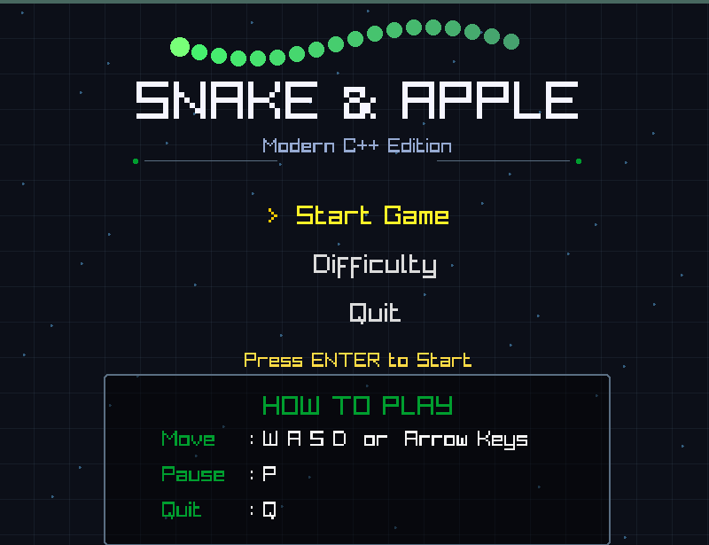

# 🐍 Snake & Apple

A modern recreation of the classic **Snake** game built in **C++20** using **Raylib**.

Featuring smooth animations, a modern pixel-inspired interface, multiple difficulty levels, persistent high-score saving, and a clean object-oriented architecture, this project demonstrates modern C++ programming techniques while recreating one of the most iconic arcade games.

---

## 📸 Screenshots

### Main Menu



### Gameplay


### Pause Screen


### Game Over


---

## ✨ Features

- 🎮 Modern animated main menu
- 🐍 Smooth snake movement using interpolation
- 🍎 Animated apple with custom rendering
- ⚡ Three difficulty modes
  - Easy
  - Medium
  - Hard
- 💾 Persistent high-score saving
- ⏸ Pause / Resume functionality
- 🎨 Pixel-inspired UI and HUD
- 🧩 Object-Oriented Design
- ⚙ Built using CMake
- 🌍 Cross-platform (Windows, Linux, macOS)

---

## 🕹 Controls

| Key | Action |
|------|--------|
| **W / ↑** | Move Up |
| **S / ↓** | Move Down |
| **A / ←** | Move Left |
| **D / →** | Move Right |
| **Enter** | Select Menu Option |
| **P** | Pause / Resume |
| **Q / Esc** | Quit |

---

## 🏗 Project Structure

```
snake_and_apple_game_cpp
│
├── screenshots/
│   ├── gameplay.png
│   ├── paused.png
│   ├── game_over.png
│   └── title_screen.png
│
├── src/
│   ├── Animation.cpp/.h
│   ├── Apple.cpp/.h
│   ├── Common.h
│   ├── Game.cpp/.h
│   ├── Menu.cpp/.h
│   ├── Renderer.cpp/.h
│   ├── Snake.cpp/.h
│   └── main.cpp
│
├── CMakeLists.txt
└── README.md
```

---

## 🚀 Build Instructions

### Requirements

- CMake 3.16+
- C++20 compatible compiler
- Git

Raylib is automatically downloaded and built by CMake.

```bash
git clone https://github.com/mimansha-03/snake_and_apple_game_cpp.git

cd snake_and_apple_game_cpp

mkdir build
cd build

cmake ..

cmake --build .
```

Run:

```bash
./snake_game
```

or on Windows

```bash
snake_game.exe
```

---

## 💡 Modern C++ Concepts Used

This project showcases several modern C++20 features including:

- Concepts
- Templates
- Object-Oriented Programming
- RAII
- STL Containers
- Smart code organization
- Separate rendering and game logic

---

## 🎯 Future Improvements

- Sound effects & background music
- Power-ups
- Animated particle effects
- Theme customization
- Leaderboard
- Controller support

---

## 📚 Technologies

- C++20
- Raylib
- CMake
- Git
- GitHub

---

## ⭐ If you like this project

Consider giving the repository a ⭐ on GitHub!