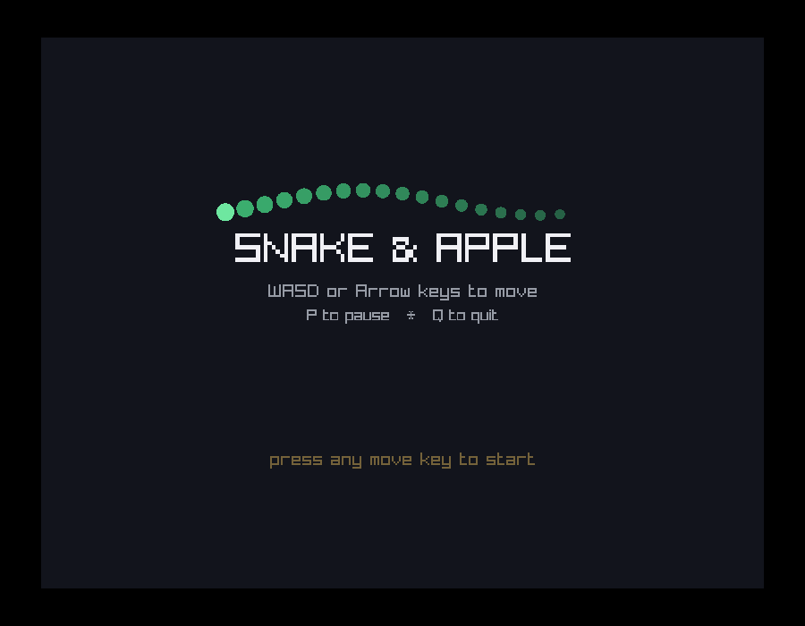
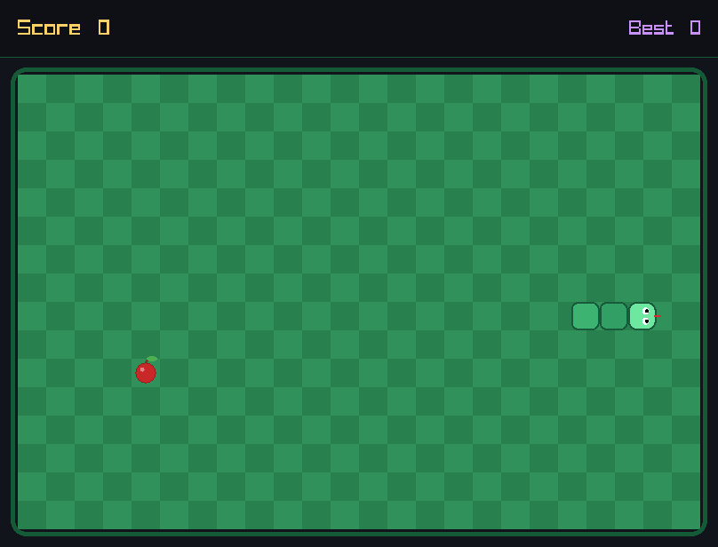
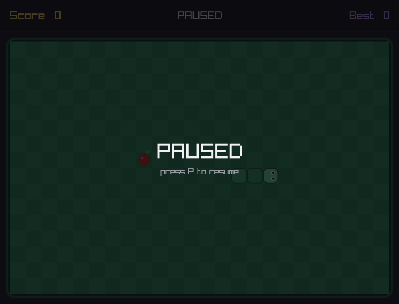
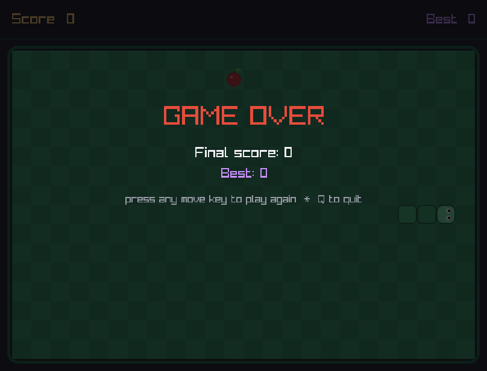

# Snake & Apple 🐍🍎

A real graphical Snake game written in modern **C++20**, rendered with
[raylib](https://www.raylib.com/) — a proper checkerboard playfield, a
segmented snake with directional eyes and a flicking tongue, a glossy
animated apple, smooth motion interpolation between grid steps, and full
title / pause / game-over screens.

It's also built to showcase the C++20 **`concepts`** language feature for
generic, compile-time-checked game code (see below).

## Screenshots

| Title screen | Gameplay |
|---|---|
|  |  |

| Paused | Game over |
|---|---|
|  |  |

*(These are real screenshots of the compiled game, not mockups.)*

## Features

- **Real 2D graphics** — checkerboard grass board, rounded snake segments
  with a brighter head, blinking eyes that track your direction, an
  occasional tongue flick, and an apple with a stem, leaf, and shine.
- **Smooth motion** — the snake's position is interpolated between logic
  ticks, so it glides instead of snapping cell-to-cell.
- **Increasing difficulty** — speeds up as the snake grows.
- **Pause / Resume** (`P`), **Quit** (`Q` / `Esc`), **restart** after game over.
- **Persistent high score**, saved to `highscore.txt` next to the executable.
- **Cross-platform** — Windows, macOS, and Linux, via CMake.
- **No manual library install needed** — CMake automatically downloads and
  builds raylib from source the first time you configure the project.

## Why C++20 `concepts`?

The project uses the actual C++20 language feature `concept`/`requires`
(not just "the concept of good design") to constrain generic game code:

```cpp
// Common.h
template<typename T>
concept Positionable = requires(const T& t) {
    { t.getPosition() } -> std::same_as<Position>;
};

template<typename T>
concept MultiCell = requires(const T& t) {
    { t.occupiedCells() } -> std::convertible_to<const std::vector<Position>&>;
};

template<Positionable A, Positionable B>
bool collides(const A& a, const B& b) { return a.getPosition() == b.getPosition(); }
```

Both `Snake` and `Apple` satisfy `Positionable` simply by exposing a
`getPosition()` method — no inheritance, no virtual dispatch. `Snake` also
satisfies `MultiCell` via `occupiedCells()`, which is how `Game` asks the
apple to avoid spawning on the snake without either class needing to know
about the other's internals. Any future game object (a power-up, say) gets
the same generic collision/placement logic for free just by shaping its
interface the same way — and the compiler rejects any type that doesn't fit,
with a readable error, instead of a runtime crash.

## Project structure

```
snake_game_gfx/
├── CMakeLists.txt        # CMake build - fetches & builds raylib automatically
├── screenshots/           # Real screenshots (see above)
└── src/
    ├── Common.h            # Position, Direction, and the C++20 concepts
    ├── Snake.h/.cpp         # Snake body, movement, self-collision
    ├── Apple.h/.cpp         # Apple spawning + a touch of color/animation variety
    ├── Renderer.h/.cpp      # All raylib drawing (board, snake, apple, HUD, screens)
    ├── Game.h/.cpp          # Game loop, input, state machine, difficulty, save file
    └── main.cpp             # Entry point / window creation
```

## Building & running

You need **CMake ≥ 3.16**, **git**, and a **C++20 compiler** (GCC ≥ 10,
Clang ≥ 12, or MSVC ≥ 19.28 / VS 2019 16.8+). That's it — raylib itself is
fetched and compiled automatically by CMake, so there's no separate install
step for it.

```bash
mkdir build && cd build
cmake .. -DCMAKE_BUILD_TYPE=Release
cmake --build . -j
./snake_game        # or snake_game.exe on Windows
```

The first `cmake ..` will take roughly a minute since it downloads and
compiles raylib from source; subsequent builds are fast.

### Linux extra dependencies

raylib needs a few system libraries to build on Linux:

```bash
sudo apt install libgl1-mesa-dev libx11-dev libxrandr-dev libxinerama-dev \
                  libxcursor-dev libxi-dev
```

(macOS and Windows need no extra packages — CMake links the required system
frameworks/libraries automatically.)

## Controls

| Key            | Action              |
|----------------|---------------------|
| `W`/`↑`        | Move up             |
| `S`/`↓`        | Move down           |
| `A`/`←`        | Move left           |
| `D`/`→`        | Move right          |
| `P`            | Pause / resume      |
| `Q` / `Esc`    | Quit                |
| any move key   | Start / restart     |

## Notes

- The snake can't reverse directly into itself (pressing the opposite
  direction is ignored, matching classic Snake behavior).
- The outermost ring of the grid is a wall — the snake dies if it reaches it.
- High score persists between runs in `highscore.txt`, created next to the
  executable on first play.
